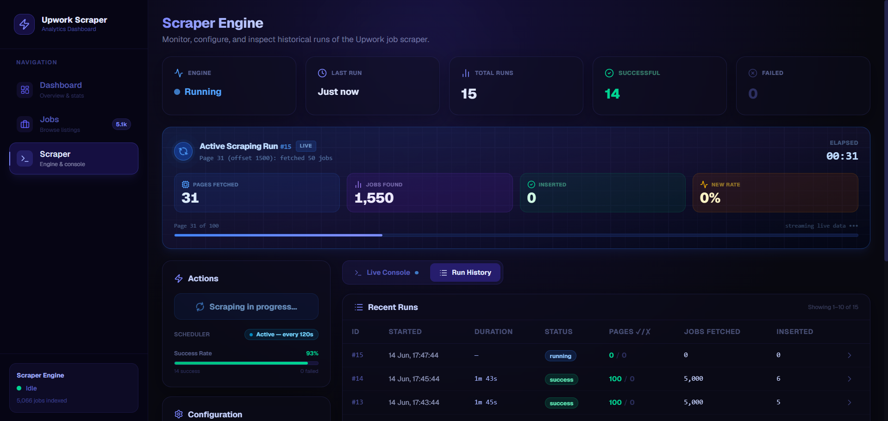
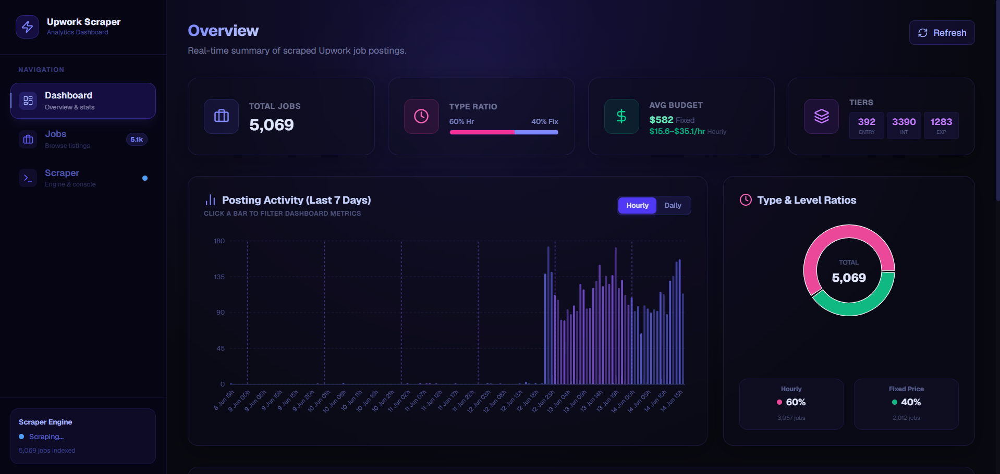

# Upwork Job Scraper Dashboard

A full-stack analytics platform that continuously scrapes public Upwork job listings, stores them in PostgreSQL, and visualises insights through a modern Next.js dashboard — all running in Docker with zero external dependencies.

No proxies. No Selenium. No Python. Just **TypeScript + got-scraping + PostgreSQL + Docker**.



---

## Features

- 🔄 **Continuous Scraping** — Automatically fetches Upwork job listings on a configurable interval (default: every 2 minutes).
- 🎯 **Browser Impersonation** — Uses `got-scraping` to mimic a real Chrome browser's TLS fingerprint, bypassing bot detection without proxies.
- 📊 **Analytics Dashboard** — Beautiful real-time charts for job types, budgets, skills, contractor tiers, and posting trends.
- 📋 **Jobs Browser** — Searchable, filterable table of all scraped jobs with full details.
- 🖥️ **Live Scraper Console** — Real-time log streaming via Server-Sent Events (SSE) with progress bars and run history.
- ⚙️ **Runtime Config** — Adjust scrape interval, page count, and page size from the UI without restarting.
- 🐘 **PostgreSQL Storage** — Efficient bulk-upsert with automatic deduplication by job cipher (ID).

---

## Architecture

```
upworkdashbord/
├── dashboard/                         # Next.js 16 application
│   ├── src/
│   │   ├── app/
│   │   │   ├── page.tsx               # Analytics dashboard (charts, stats)
│   │   │   ├── jobs/page.tsx          # Jobs browser (search, filter, table)
│   │   │   ├── scraper/page.tsx       # Scraper control panel (console, history)
│   │   │   └── api/
│   │   │       ├── scraper/route.ts   # GET status + runs | POST trigger
│   │   │       ├── scraper/stream/    # GET SSE live progress stream
│   │   │       ├── scraper/config/    # POST update scraper config
│   │   │       ├── jobs/route.ts      # GET paginated job listings
│   │   │       └── stats/route.ts     # GET dashboard analytics data
│   │   └── lib/
│   │       ├── upwork-job-scraper-manager.ts  # Core scraper (all-in-one)
│   │       ├── db.ts                          # PostgreSQL connection pool
│   │       └── utils.ts                       # Shared types & helpers
│   ├── Dockerfile.dashboard
│   └── package.json
├── migrations/
│   ├── 001_create_jobs.sql            # Jobs table DDL
│   └── 002_create_scraper_runs.sql    # Scraper run history table DDL
├── docs/
│   └── upwork-job-scraper-manager.md  # Full scraper module documentation
├── docker-compose.yml
├── .env.example
└── README.md
```

---

## How It Works

1. **Token Acquisition** — `got-scraping` GETs `https://www.upwork.com/` with a desktop Chrome TLS fingerprint to extract the `visitor_gql_token` cookie. The token is cached for 25 minutes.
2. **Job Fetching** — The token is used as a Bearer on Upwork's GraphQL API (`/api/graphql/v1`). Jobs are fetched across up to 100 pages (5,000 jobs/cycle) using 2 concurrent workers.
3. **Parsing** — Raw GraphQL results are parsed into structured records (title, description, skills, budget, type, tier, dates).
4. **Storage** — New jobs are bulk-upserted into PostgreSQL in batches of 200. Duplicates are silently skipped via `ON CONFLICT (cipher) DO NOTHING`.
5. **Scheduling** — The scraper auto-schedules the next cycle after each run. The interval is configurable from the UI at runtime.
6. **Run History** — Each cycle writes timing, page stats, job counts, and logs to the `scraper_runs` table for historical review.

---

## Pages

| Route | Description |
|---|---|
| `/` | Analytics dashboard with charts and KPI cards |
| `/jobs` | Full jobs browser with search, filter, and pagination |
| `/scraper` | Scraper control panel, live console, and run history |

---

## API Routes

| Method | Route | Description |
|---|---|---|
| `GET` | `/api/scraper` | Get scraper status, logs, and run history |
| `POST` | `/api/scraper` | Manually trigger a scrape cycle |
| `GET` | `/api/scraper/stream` | SSE stream of live scrape progress |
| `POST` | `/api/scraper/config` | Update scraper configuration at runtime |
| `GET` | `/api/jobs` | Paginated job listings with filtering |
| `GET` | `/api/stats` | Aggregated analytics data for the dashboard |

---

## Quick Start

### Prerequisites

- [Docker Desktop](https://www.docker.com/products/docker-desktop/) running

### 1. Configure environment

```bash
cp .env.example .env
```

The defaults work out of the box for local Docker:

```env
POSTGRES_PASSWORD=upwork_dev
DATABASE_URL=postgresql://upwork:upwork_dev@db:5432/upwork
SCRAPE_INTERVAL=120
MAX_PAGES=3
PAGE_SIZE=50
```

> **Tip:** Set `MAX_PAGES=100` for a full 5,000-job cycle. Start with `MAX_PAGES=3` for testing.

### 2. Build and start

```bash
docker compose up --build
```

This will:
- Start **PostgreSQL 17** and auto-run migrations on first launch.
- Build the **Next.js dashboard** (includes the embedded scraper).
- Start the dashboard at **http://localhost:3000**.

### 3. Verify it's working

Open the dashboard at [http://localhost:3000](http://localhost:3000).

Navigate to [http://localhost:3000/scraper](http://localhost:3000/scraper) to:
- View the scraper status.
- Trigger a manual scrape.
- Watch real-time logs stream in.

Or query the database directly:

```bash
docker compose exec db psql -U upwork -d upwork -c "SELECT COUNT(*) FROM jobs;"
```

### 4. Stop

```bash
docker compose down          # Stop containers, keep database
docker compose down -v       # Stop containers + wipe database volume
```

---

## Environment Variables

| Variable | Default | Description |
|---|---|---|
| `POSTGRES_PASSWORD` | *(required)* | PostgreSQL superuser password |
| `DATABASE_URL` | *(required)* | Full PostgreSQL connection string |
| `SCRAPE_INTERVAL` | `120` | Seconds between automatic scrape cycles |
| `MAX_PAGES` | `3` | Max pages to fetch per cycle (50 jobs/page) |
| `PAGE_SIZE` | `50` | Jobs per GraphQL page request (Upwork max: 50) |

> All scraper variables can also be changed at runtime via the `/scraper` page UI without restarting the container.

---

## Database Schema

### `jobs` table

```sql
CREATE TABLE jobs (
    cipher          TEXT        PRIMARY KEY,   -- Upwork job ciphertext ID (unique)
    title           TEXT,
    description     TEXT,
    link            TEXT,                      -- Full https://www.upwork.com/jobs/~ URL
    skills          TEXT[],                    -- Array of required skill labels
    published_date  TIMESTAMPTZ,
    job_type        TEXT,                      -- 'HOURLY' | 'FIXED' | 'UNKNOWN'
    is_hourly       BOOLEAN,
    hourly_low      NUMERIC,                   -- Hourly rate lower bound (USD)
    hourly_high     NUMERIC,                   -- Hourly rate upper bound (USD)
    budget          NUMERIC,                   -- Fixed-price budget (USD)
    duration_weeks  INTEGER,
    contractor_tier INTEGER,                   -- 1=Entry, 2=Intermediate, 3=Expert
    scraped_at      TIMESTAMPTZ DEFAULT NOW()
);
```

### `scraper_runs` table

```sql
CREATE TABLE scraper_runs (
    id               SERIAL PRIMARY KEY,
    start_time       TIMESTAMPTZ NOT NULL DEFAULT NOW(),
    end_time         TIMESTAMPTZ,
    status           VARCHAR(50) NOT NULL DEFAULT 'running', -- 'running'|'success'|'error'
    pages_success    INT NOT NULL DEFAULT 0,
    pages_failed     INT NOT NULL DEFAULT 0,
    jobs_fetched     INT NOT NULL DEFAULT 0,
    jobs_inserted    INT NOT NULL DEFAULT 0,
    duration_seconds NUMERIC(10,2),
    details          JSONB,    -- Per-page stats array
    logs             TEXT      -- Full log buffer for the run
);
```

---

## Tech Stack

| Layer | Technology |
|---|---|
| **UI Framework** | Next.js 16 (App Router) |
| **Language** | TypeScript |
| **Styling** | Vanilla CSS |
| **Charts** | Recharts |
| **Icons** | Lucide React |
| **HTTP / Scraping** | got-scraping (browser TLS impersonation) |
| **Database Client** | pg (node-postgres) |
| **Database** | PostgreSQL 17 |
| **Container Runtime** | Docker + Docker Compose |

---

## Project Documentation

| Document | Description |
|---|---|
| [docs/upwork-job-scraper-manager.md](./docs/upwork-job-scraper-manager.md) | Full documentation for the scraper module: architecture, all public API methods, environment variables, error classes, data flow diagram, and caveats |

---

## Useful Commands

```bash
# View live logs from the dashboard container
docker compose logs -f dashboard

# Restart only the dashboard (e.g., after a code change)
docker compose restart dashboard

# Rebuild and redeploy cleanly
docker compose down && docker compose up --build -d

# Full reset (wipe all data and rebuild)
docker compose down -v && docker compose up --build -d

# Open a PostgreSQL shell
docker compose exec db psql -U upwork -d upwork

# Count scraped jobs
docker compose exec db psql -U upwork -d upwork -c "SELECT COUNT(*) FROM jobs;"

# View recent scraper runs
docker compose exec db psql -U upwork -d upwork \
  -c "SELECT id, status, jobs_inserted, duration_seconds, start_time FROM scraper_runs ORDER BY start_time DESC LIMIT 10;"
```

---

## Known Limitations

- **Guest token scope** — The `visitor_gql_token` is a guest-level cookie without OAuth2 scopes. Client metadata fields (ratings, payment verification, hire rate) are not accessible and stored as `NULL`.
- **No proxy support** — All requests originate from the host machine's IP. Consider reducing `MAX_PAGES` or increasing `SCRAPE_INTERVAL` if Upwork rate-limits your IP.
- **Rate limiting** — Upwork may occasionally return HTTP 429. Per-page failures are gracefully handled and logged, but the cycle continues for other pages.
